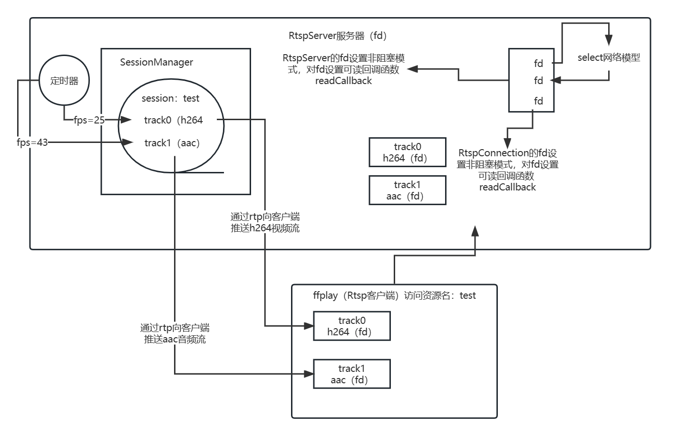

# RTSP流媒体服务器


## 项目结构



## 构建

```shell
mkdir build
cd build
cmake ..
make
```

## 运行

```shell
./RstpServer
```

## FFplay播放

tcp模式播放

```shell
ffplay -i rtsp://127.0.0.1:11451/test -rtsp_transport tcp
```

udp模式播放

```shell
ffplay -i rtsp://127.0.0.1:11451/test
```